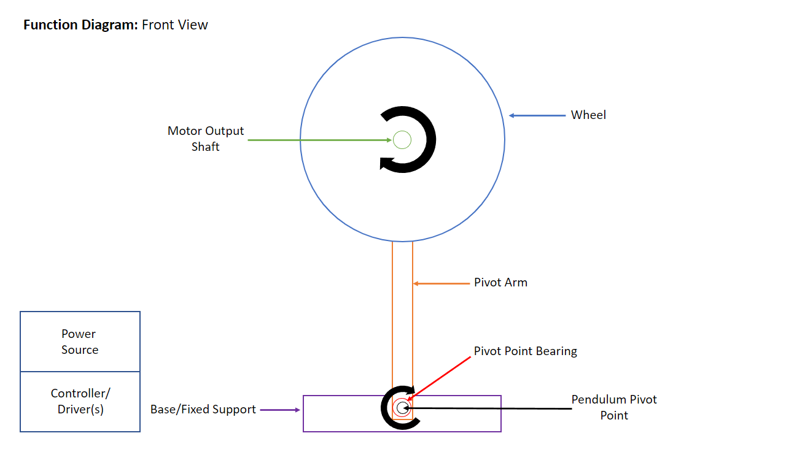
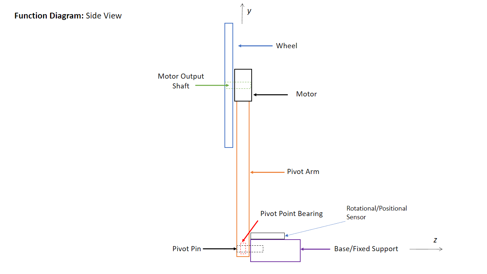
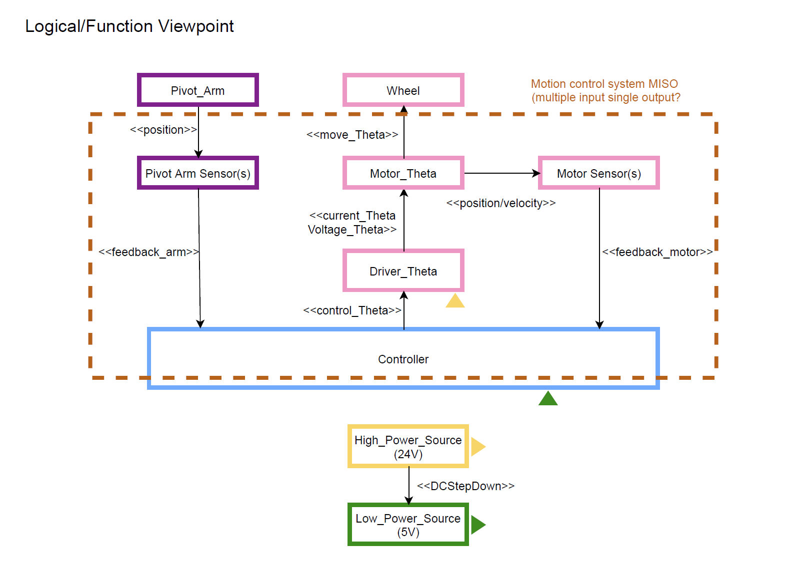
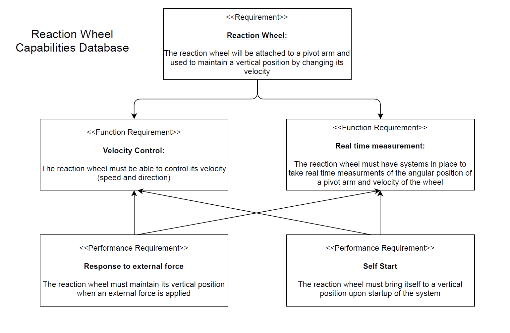

# CSU Chico, MECA 482 Fall 2021 Inertia Wheel Project
### Team Members: Anthony Aliotti, Shelby Bartlett, Jacob Corbin, Nate Hilal, Alex Schweizer


## Concept Design

### Operational Viewpoint




### Logical Functional Viewpoint


### Capabilities Database


### Report

```markdown
Syntax highlighted code block

# Header 1
## Header 2
### Header 3

- Bulleted
- List

1. Numbered
2. List

**Bold** and _Italic_ and `Code` text

[Link](url) and 
```

