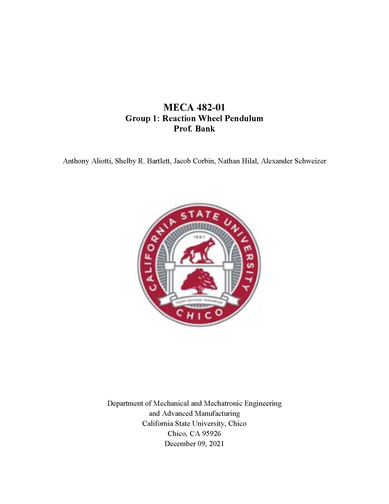
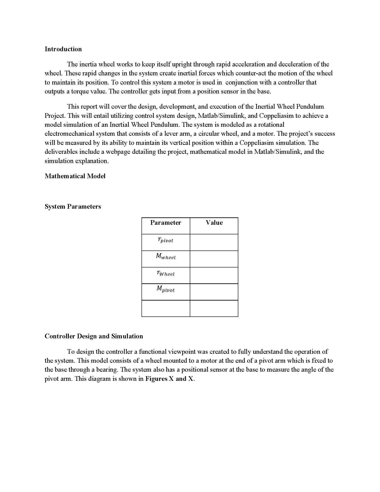
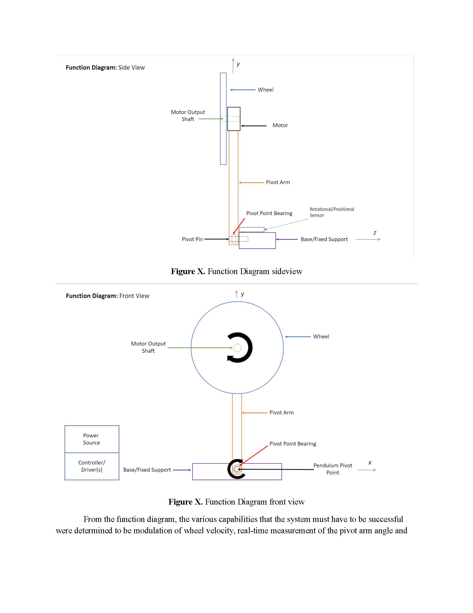
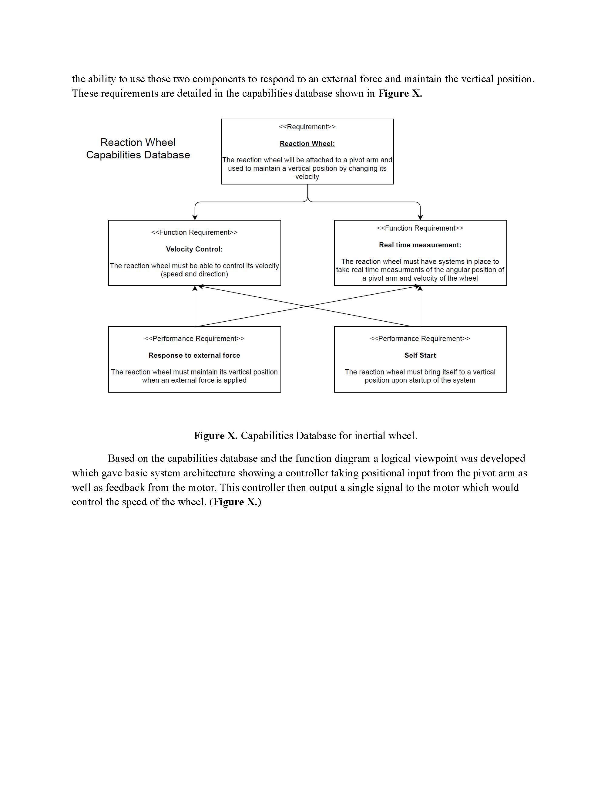
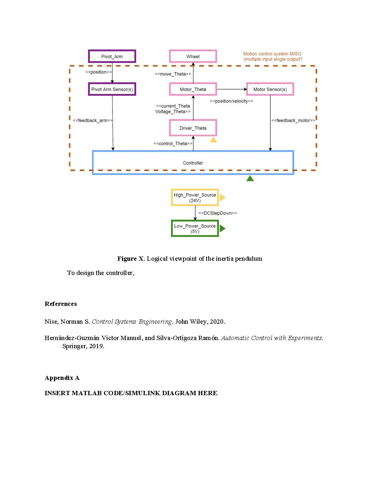

# CSU Chico, MECA 482 Fall 2021 Inertia Wheel Project
### Team Members: Anthony Aliotti, Shelby Bartlett, Jacob Corbin, Nate Hilal, Alex Schweizer

## Report
A PDF is provided of the report [HERE](https://drive.google.com/file/d/1PsqEJN0E3LL2bM953LPChFb6GJb5_Yi9/view?usp=sharing).

### Video Presentation
[Video Presentation](https://youtu.be/jPzScW46sSw)

### View Simulation Files
[Simulation Files](https://github.com/n-hilal/MECA-482-Group-1-F21)
