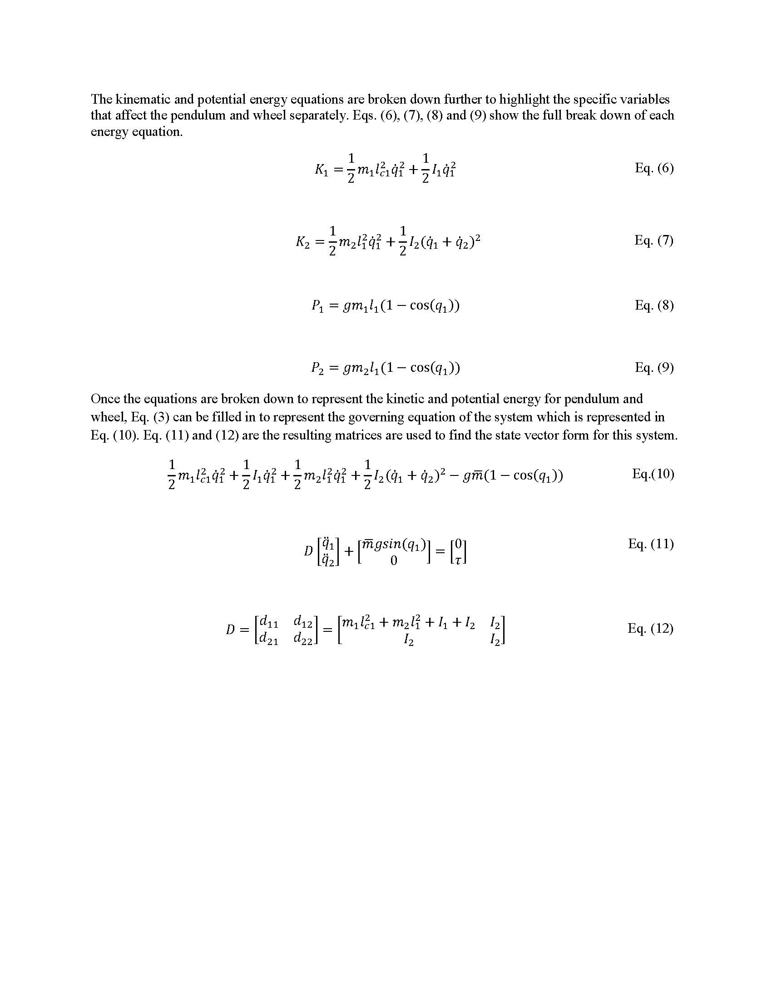
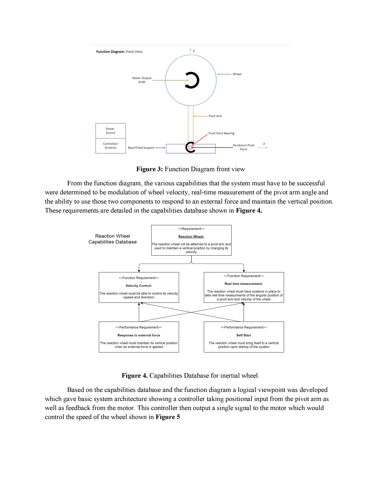

# CSU Chico, MECA 482 Fall 2021 Inertia Wheel Project
### Team Members: Anthony Aliotti, Shelby Bartlett, Jacob Corbin, Nate Hilal, Alex Schweizer

## Video Presentation
[Video Presentation](https://youtu.be/jPzScW46sSw)

## View Simulation Video
[Simulation Video](https://youtu.be/cp-yuhqAYWQ)

## View Simulation Files
[Simulation Files](https://github.com/n-hilal/MECA-482-Group-1-F21)

## Report
A PDF is provided of the report [HERE](https://drive.google.com/file/d/1nl_yy1Q_7oCafQRvecrXgBNNImxdEhhZ/view?usp=sharing).

